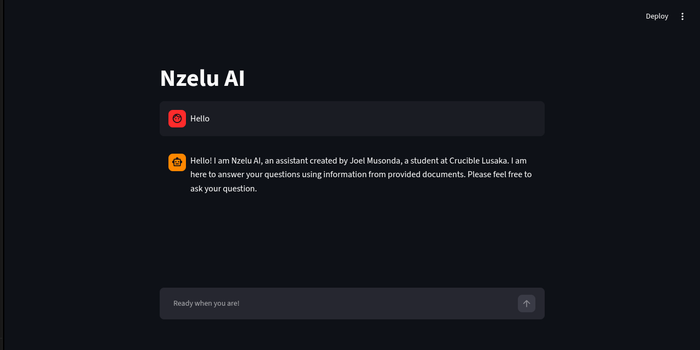
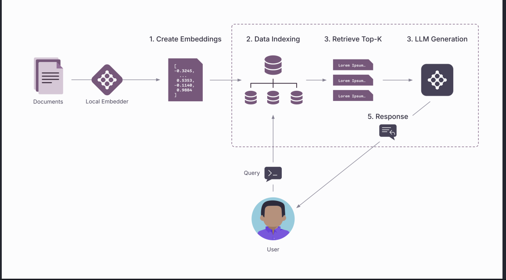
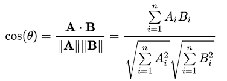
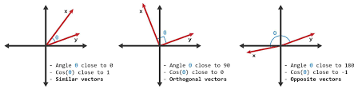

# Nzelu AI

## 🎯Overview

Derived from the Bemba word - Nzelu, which means Knowledge, is a lightweight,  Retrieval-Augmented Generation (RAG) assistant designed to live  within a student or researcher's  documentation space. Acting as an empathetic and highly precise companion, it extracts domain-specific context from uploaded knowledge bases to deliver contextually grounded, low-latency answers without hallucination.




## 🏗️ System Architecture & Engineering Blueprint

Nzelu AI splits the traditional LLM bottleneck into two independent asynchronous pipelines: an Ingestion Pipeline and a Runtime Execution Pipeline.





  <h3>The Ingestion & Vector Dense Space Pipeline
Document Processing </h3>: Documents are parsed and subjected to a structured RecursiveCharacterTextSplitter. Chunk sizes are set to 1000 tokens with a 200 token overlap to protect semantic context boundaries across text splits.

Mathematical Vector Representation: Text chunks are transformed into dense numerical vectors using the Google gemini-embedding-2-preview model.

Vector Indexing: High-dimensional vector vectors are indexed into a serverless Pinecone database cluster utilizing Cosine Similarity



 

   <h3>Runtime Retrieval & Execution Pipeline
Similarity Score Threshold Filtering </h3>: Unlike naive RAG pipelines that fetch arbitrary data using a blind K-nearest neighbor (K-NN) search, Nzelu AI implements an advanced similarity_score_threshold set strictly to 0.3. If no document meets this relevance mathematical bar, the system automatically cuts off irrelevant noise to prevent the LLM from hallucinating.

Stateful Memory Orchestration: Leveraging streamlit.session_state, the execution thread preserves a sliding window list of typed message classes (HumanMessage, SystemMessage, AIMessage).

Dynamic Context Injection: The system programmatically serializes the raw page content fetched by the vector store, formats it cleanly into a dynamic runtime system prompt block, and executes an atomic context-aware inference request via the highly optimized gemini-2.5-flash model.

## 🛠️ Tech Stack & Key Technical Decisions


| Component |  Technology | Reason |
| -------- | -------- | -------- |
| Frontend | Streamlit| Eliminates heavy frontend state management overhead, allowing rapid prototyping of stateful reactive components using native session threading. |
| Ochestrator | Langchain | Provides a unified, modular abstraction layer using predictable object schemas, ensuring seamless swaps between underlying models and database clients.|
|Vector Database| Pinecone | Offloads mathematical multi-dimensional indexing to a fully managed cloud service, maintaining sub-millisecond retrieval speeds without consuming local laptop memory resources. |

|Programming Language| Python 3.13|Leverages the latest native interpreter optimizations, enhanced garbage collection, and faster package execution.|


## 🚀 Quick Start

Get two API keys; Gemini API and Pinecone. Clone the project using the command below:


```bash
  git clone https://github.com/joel-musonda/nzeluai-rag.git
```

Go to the project directory

```bash
  cd nzeluai-rag
```

Install dependencies

```bash
  pip Install -r requerements.txt
```

Start the server

```bash
  python retrieval.py
  python ingestion.py
  streamlit run chatbot_rag.py
``` 